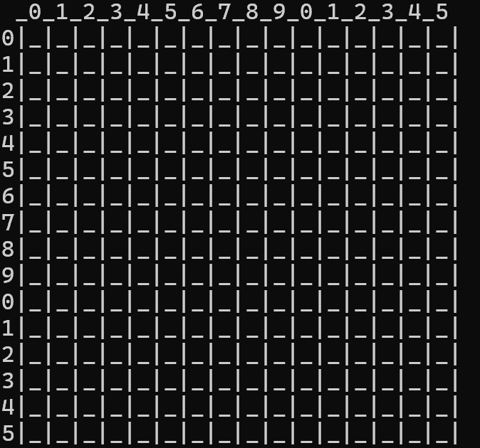

# Minesweeper

## 실행 방법

1. 저장소를 다운로드합니다.
2. `minesweeper.sln` 파일을 Visual Studio에서 실행합니다.
3. 빌드 후 실행 (`Ctrl + F5`) 합니다.

---

## 프로젝트 설명

C 언어를 활용하여 **콘솔 기반 지뢰찾기 게임(Minesweeper)** 을 구현한 프로젝트입니다.

난이도 선택 기능(1~3단계)을 제공하며,  
랜덤 지뢰 생성 및 주변 지뢰 수 계산 기능을 구현했습니다.

---

## 주요 기능

- 난이도 선택 (초급 / 중급 / 고급)

| 난이도 | 크기 | 지뢰 수 |
|--------|------|---------|
| 초급 (1) | 9 × 9 | 10개 |
| 중급 (2) | 16 × 16 | 40개 |
| 고급 (3) | 16 × 30 | 99개 |
- 랜덤 지뢰 생성
- 주변 지뢰 개수 계산
- `flood_fill` 알고리즘을 활용한 빈 칸 자동 열기
- 콘솔 기반 게임 화면 출력

---

## 실행 화면

콘솔 환경의 한계를 고려하여  
좌표 기반 입력이 쉽도록 행과 열 번호를 표시하고,  
격자 형태의 출력을 통해 지뢰찾기 판 구조를 직관적으로 표현했습니다.

---

## 구현 내용

### 콘솔 화면 갱신

`system("cls");` 를 활용하여  
이전 출력 내용을 지우고 게임 화면을 새롭게 출력하도록 구현했습니다.

### flood_fill 알고리즘 적용

`flood_fill` 알고리즘을 활용하여  
주변에 지뢰가 없는 칸을 선택하면 연결된 빈 영역이 자동으로 열리도록 구현했습니다.

---

## 개발 환경 및 사용 기술

- **Language**
  - C

- **IDE**
  - Visual Studio

- **Environment**
  - Console

---

## 배운 점

- 2차원 배열을 활용한 게임 보드 관리
- 재귀 함수(`flood_fill`) 활용 경험
- 랜덤 지뢰 생성 로직 구현
- 콘솔 환경에서 UI 출력 방식 이해

---
